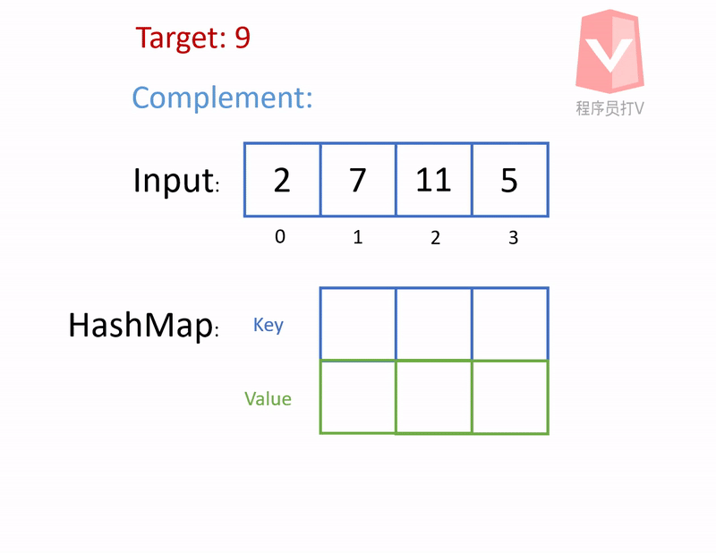

# Two Sum

## Problem Description

Given an array of integers, return **indices** of the two numbers such that they add up to a specific target.

You may assume that each input would have **exactly** one solution, and you may not use the same element twice.

**Example:**

```
Given nums = [2, 7, 11, 15], target = 9,

Because nums[0] + nums[1] = 2 + 7 = 9,
return [0, 1].
```

## Analysis

A simple and efficient way is to use HashMap because HashMap has O(1) lookup efficiency. 

Since we are looking for a pair of numbers that add up to a target number, we can store the **complement number** in HashMap while we are iterating the input numbers. 

At the same time, we also use HashMap to check if there is a number which its complement number equals our current number.

 If there is one, then we know that these numbers add up to the target number. Therefore, we can return the indices of these two numbers.

## Algorithm

1. while iterating the array of input

2. check HashMap using current number as the key

3. if we get a result, return the value from the result and the current index

2. else, store the complement number as key and index as value in HashMap

### Animation



### Java Code

```java
class Solution {
    public int[] twoSum(int[] nums, int target) {

        Map<Integer, Integer> map = new HashMap<>();
        int[] solution = new int[2];
        
        for (int i = 0; i < nums.length; i++) {
            
            int number = nums[i];
            
            Integer result = map.get(number);
            
            if (result != null) {

                solution[0] = result;
                solution[1] = i;
                
                return solution;
            }
            
            int complement = target - nums[i];
            
            map.put(complement, i);

        }
        
        return solution;
    }
}
```

## Efficiency

O(n)

Since HashMap lookup complexity is O(1), and we need to iterate through the array, the time complexity is O(1) * O(n).

As a result, we get O(n) as the efficiency of this solution.
